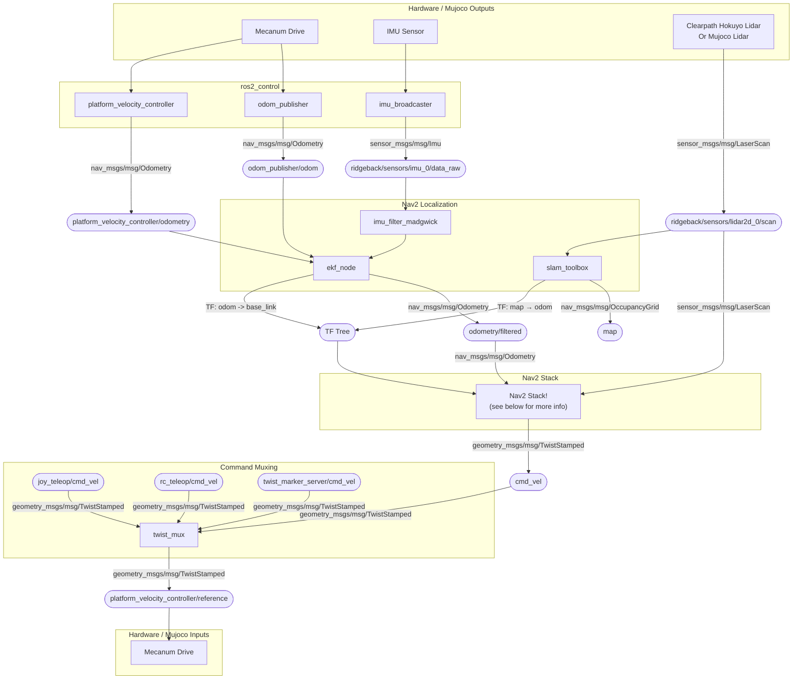
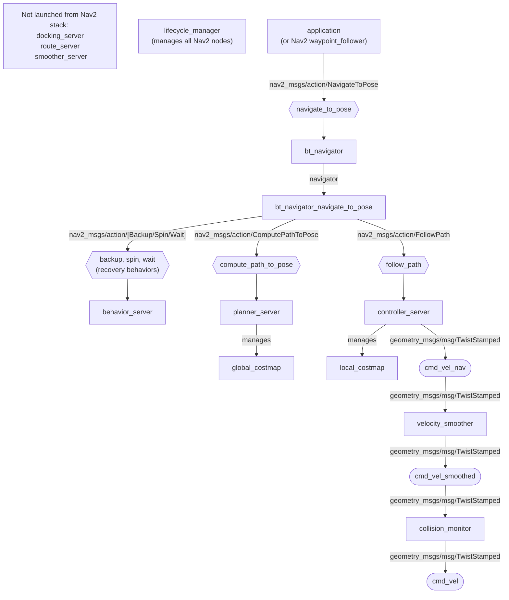

# Phoebe Nav2 Config

Phoebe comes with a basic nav2 integration that works on hardware and in the dynamic simulation.
The topics are all intended to match across systems.

## Usage

Regular launch:

```bash
ros2 launch phoebe_nav2_config phoebe_nav.launch.py use_sim_time:=true
```

When running Phoebe in magic carpet mode, we should disable localization.
The magic carpet controller publishes both the odom topic and the `odom -> base_link` TF directly from ground truth.
Running an EKF on top of perfect odometry only introduces drift!

SLAM can remain enabled, if desired.
By default, however, Phoebe's Nav2 config _disables_ SLAM in magic carpet mode, instead publishing a static TF from `map -> odom` to prevent noise.

Ensure the world joints (linear x, linear y, yaw) are **not** published by `joint_state_broadcaster`, so `robot_state_publisher` doesn't produce a competing `odom -> base_link` chain from the URDF.

```bash
# Launches the MuJoCo sim with a magic carpet
ros2 launch phoebe_mujoco_config phoebe_mujoco.launch.py magic_carpet:=true

# Be sure to let nav2 know, as odometry and slam will be adjusted
ros2 launch phoebe_nav2_config phoebe_nav.launch.py use_sim_time:=true magic_carpet:=true
```

## Diagram

Wiring nav2 together and figuring out where it is disconnected can be difficult.
The diagram below is a rough map of the nodes, topics, and controllers involved.
When things aren't working it should give users a rough idea of where connections are made.



A closer look at the Nav2 stack:



## Debugging

Since Nav2 involves so many nodes working together, it can be difficult to debug or diagnose what the problem may be when navigation behaviors do not perform as expected.
A few things we have found helpful:

- **Planned Paths**: Check the planned path from the `planner_server` seems reasonable.
In RViz, inspect the path (`nav_msgs/msg/Path`) on topic `plan`.
- **Controller Commands**: Check the velocity command topics from the Nav2 stack:
  - `cmd_vel_nav`: output from `controller_server`
  - `cmd_vel_smoothed`: output from `velocity_smother`
  - `cmd_vel`: output from `collision_monitor`, which is sent to the platform's `twist_mux` to command the robot
- **Robot Footprint**: Check the robot's footprint against the obstacles.
In RViz, inspect the footprint polygon (`geometry_msgs/msg/PolygonStamped`) on topic `local_costmap/published_footprint` and local and global costmaps (`nav_msgs/msg/OccupancyGrid`) on topics `local_costmap/costmap` and `global_costmap/costmap` respectively.
- **Collisions**: The `collision_monitor` node is configured to clip velocity commands to prevent collisions based on the robot's configured polygons.
If one of the monitor's polygons triggers an event to clip the commands, the responsible polygon will be published as a `nav2_msgs/msg/CollisionMonitorState` to topic `collision_monitor_state`.

## Citation

This project falls under the purview of the iMETRO project.
If you use this in your own work, please cite the following paper:

```bibtex
@INPROCEEDINGS{imetro-facility-2025,
  author={Dunkelberger, Nathan and Sheetz, Emily and Rainen, Connor and Graf, Jodi and Hart, Nikki and Zemler, Emma and Azimi, Shaun},
  booktitle={2025 22nd International Conference on Ubiquitous Robots (UR)},
  title={Design of the iMETRO Facility: A Platform for Intravehicular Space Robotics Research},
  year={2025},
  volume={},
  number={},
  pages={390-397},
  keywords={NASA;Moon;Seals;Maintenance engineering;Maintenance;Robots;Standards;Open source software;Testing;Logistics},
  doi={10.1109/UR65550.2025.11077983}}
```
